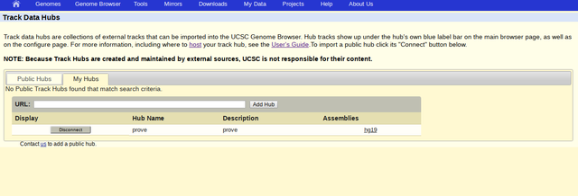

Welcome to UcscHubgeneratoR
================

Displaying and managing custom tracks into a Genome Browser (UCSC) can be annoying.

For this reason we have created a R package that facilitates the creation and upload of custom tracks based on [track hubs](https://genome.ucsc.edu/goldenPath/help/hgTrackHubHelp.html). A track hub is way of organizing large numbers of genome-wide data sets, configured with a set of plain-text files that determine the organization, UI, labels, color, and other details. The data underlying the tracks and optional sequence in a hub reside on the remote server of the data provider rather than at UCSC. Genomic annotations are stored in compressed binary indexed files in bigBed, bigBarChart, bigGenePred, bigNarrowPeak, bigPsl, bigChain, bigInteract, bigMaf, bigWig, BAM, CRAM, HAL or VCF format that contain the data at several resolutions. For more information about the types and parameters visit [trackDb information](https://genome.ucsc.edu/goldenPath/help/trackDb/trackDbHub.html). Currently the allowed parameters are: type, visibility, color and autoScale, shortLabel and longLabel.

Ucscgenerator package requires a GATTACA SSH Key of the GATTACA user saved in the host where it will be run. For a detailed guide please check [SSH Key](https://www.ssh.com/ssh/keygen/).

Installation
------------

The following code demonstrates a track hub built out of all bigWig files found in a directory.

    #> Loading required package: usethis
    #> Skipping install of 'ucschubgenerator' from a github remote, the SHA1 (df51c467) has not changed since last install.
    #>   Use `force = TRUE` to force installation

Basic Example
-------------

### Download example dataset

    #> Will begin downloading datasets to /tmp/RtmpVT75kp/file3049e2b2071
    #> untar: using cmd = '/bin/tar -xf '/tmp/RtmpVT75kp/file3049e2b2071' -C './''
    #> Done writing ucschubgenerator example files to ./

### Create the trackhub

In this example, a trackhub with the same type of tracks and parameters will be created. In the following example will be face trackhubs with different file types and parameters.

In this case we will select the '.vcf.gz' of the 'example\_data' download previously and saved in the 'path' variable. All the 'vcf.gz' will present the same parameters defined for this particular hub.

    #> Warning in dir.create(path_local_hub): './/example_data/hubs' already exists
    #> 2020-04-30 11:41:28 
    #>  Starting hubGenerator using:
    #>  >Path local hub: .//example_data/hubs 
    #>  >Hub name: example_hub_unique 
    #>  >Hub short label: example_hub_unique 
    #>  >Hub long label: Example of ucschubgenerator using only one type of file with a unique set of parameters 
    #>  >Email address: example@email.com 
    #>  >Description url:  
    #>  >Assembly database: hg38 
    #>  >Gattaca html: http://gattaca.imppc.org/genome_browser/lplab 
    #>  >Gattaca folder hub: exampleHub
    #> 2020-04-30 11:41:28 
    #>  Finished hubGenerator
    #> [1] "http://gattaca.imppc.org/genome_browser/lplab/exampleHub/example_hub_unique/hub.txt"

Once the script ends, you can upload the hub in the [USCS web](https://genome.ucsc.edu/cgi-bin/hgHubConnect?hubCheckUrl=http%3A%2F%2Fgattaca.imppc.org%2Fgenome_browser%2Flplab%2FmarcHubs%2FparserProve%2Fhub.txt&hgsid=759593043_P7LJWoCqmm0BrJx4xCRwGGvMCkRt). selecting My Hubs and pasting the link generated (server link of the hub.txt file).

To visualize it, is necessary to open the appropriate human assembly and the track hub will appear under the Custom Tracks.

This time we will create a hub with different types of tracks and different parameters.

    #> Warning in dir.create(path_local_hub): './/example_data/hubs' already exists
    #> 2020-04-30 11:41:29 
    #>  Starting hubGenerator using:
    #>  >Path local hub: .//example_data/hubs 
    #>  >Hub name: example_hub_multiple 
    #>  >Hub short label: example_hub_multiple 
    #>  >Hub long label: Example of ucschubgenerator using different type of files and parameters 
    #>  >Email address: example@email.com 
    #>  >Description url:  
    #>  >Assembly database: hg38 
    #>  >Gattaca html: http://gattaca.imppc.org/genome_browser/lplab 
    #>  >Gattaca folder hub: exampleHub
    #> 2020-04-30 11:41:29 
    #>  Finished hubGenerator
    #> [1] "http://gattaca.imppc.org/genome_browser/lplab/exampleHub/example_hub_multiple/hub.txt"
